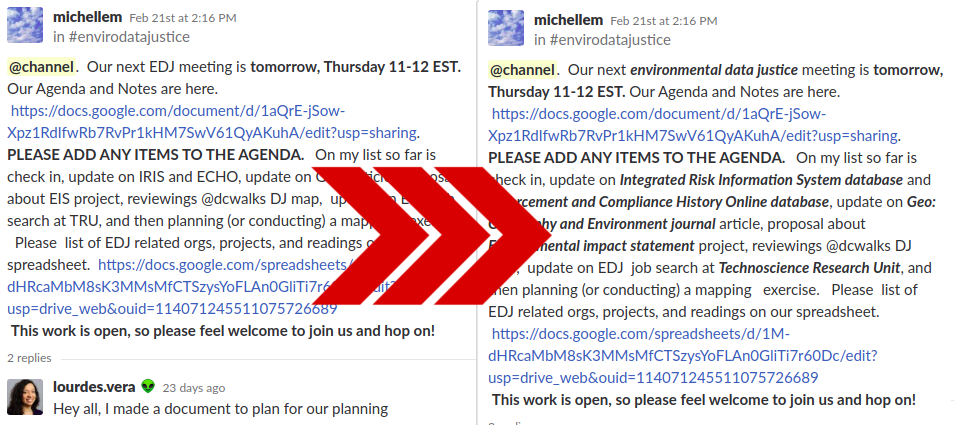

# EDGI Acronym Expander Chrome Extension

This tool attempts to expand acronyms commonly used in communications
among members of the Environmental Data & Governance Initiative (EDGI).

Works in:
- Slack chat
  - EDGI
  - Archivers
- GitHub issues
  - Data Together organization
  - EDGI organization

## Goal

To make it simpler for those participating in EDGI project conversations
to speak a common language with less jargon, with particular focus on
these groups:

  * **observers** who wish to better follow along,
  * **new contributors** who want to participate more freely, and
  * **existing contributors** visiting from other EDGI projects, for whom terms can seem foreign.

## Screenshot

## Modifying Acronyms

The [JSON file `acronyms.json`](acronyms.json) is modified by editting a
[Google Spreadsheet of
terms](https://docs.google.com/spreadsheets/d/1o1AezDZ6TQyRBTpbDn9J4fFbgOPJEX7YOGYr8_0Hb4s/edit#gid=1602058310).

The JSON is regenerated from this online spreadsheet by running this
local command in terminal from the git repo root directory:

    $ make pull-acronyms

## Scope

This extension currently works on these websites:

  * archivers.slack.com
  * edgi.slack.com
